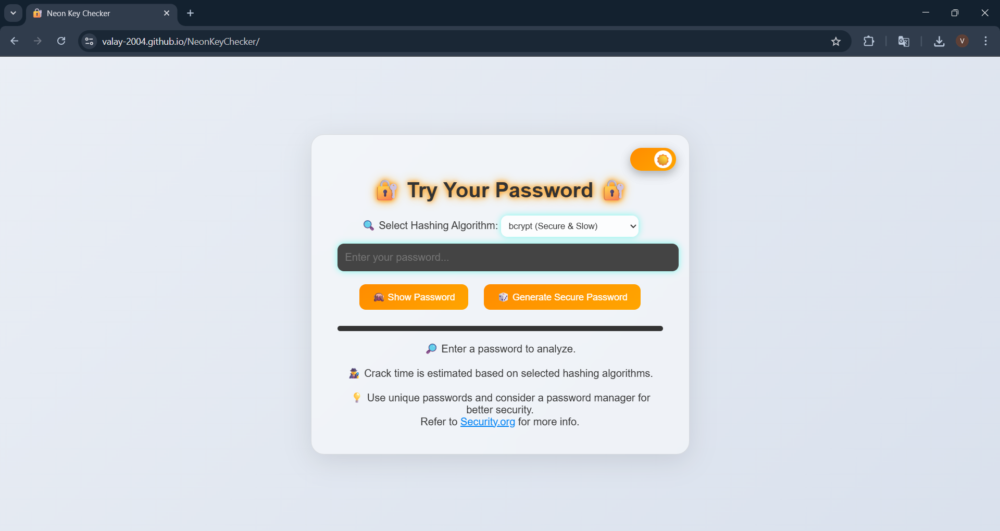
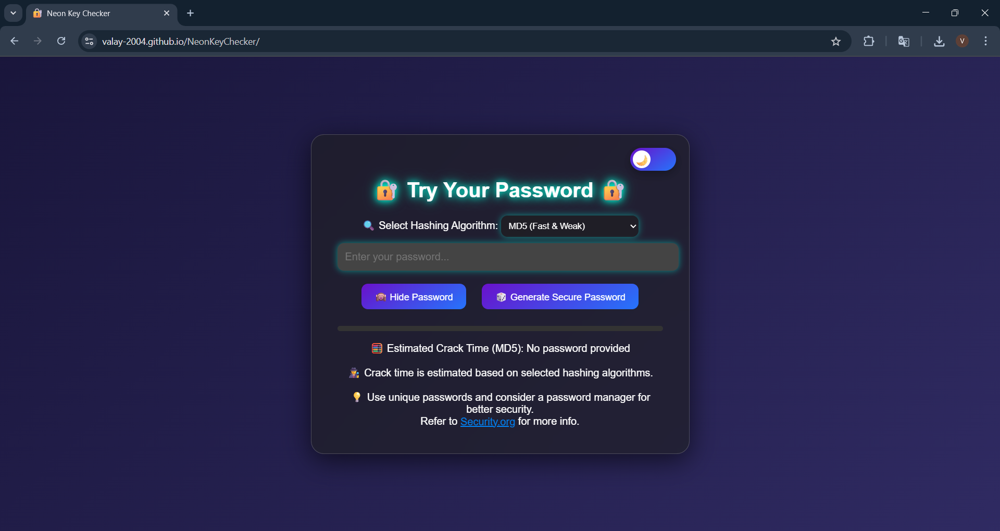

# 🔐 NeonKeyChecker – Password Strength Analyzer

**NeonKeyChecker** is a modern, browser-based tool that helps users evaluate password strength using realistic crack-time simulations across different hashing algorithms. It features real-time feedback, dynamic UI, and tools that emphasize secure password practices in a fun yet educational way.

---

## 🧪 How It Works

1. Enter a password and get dynamic feedback.
2. Select a hashing algorithm to simulate real-world cracking speeds.
3. Generate strong random passwords on demand.
4. Toggle between light/dark themes.
<!-- 5. Export analysis as a PDF. -->

### 🔍 Attack Model Assumption
**NeonKeyChecker** estimates password crack time by simulating a pure brute-force offline attack, assuming the attacker has access to the password hash (not the plaintext) and no prior context about the user.

The estimated crack time is calculated using:
- Password length & character variety (entropy)
- Hashing algorithm speed (e.g., bcrypt vs MD5)

<b>❌ This does not simulate <i>dictionary, rainbow table, or social engineering attacks</i> — it's purely to visualize strength against raw computational brute-force attempts.</b>

---

## 🖼️ Live Demo
👉 [Try it here](https://valay-2004.github.io/NeonKeyChecker/)

---

## ✨ Features

- ⚡ **Real-Time Strength Analysis** using [zxcvbn](https://github.com/dropbox/zxcvbn)
- 🧠 **Hashing Algorithm Simulation** (bcrypt, SHA-256, MD5)
- 🌐 **Responsive & Aesthetic UI** with Glassmorphism & Animations
- 🎲 **Secure Password Generator** with one-click copy
- 🌗 **Dark/Light Mode Toggle** with animated icon switch
<!-- - 📄 **Export Password Report as PDF** -->

---

## 📸 Preview

| Light Mode 🌞 | Dark Mode 🌙 |
|--------------|--------------|
|  |  |


---

## 🛠️ Tech Stack

- **Frontend:** HTML5, CSS3, JavaScript (Vanilla)
- **Libraries:** 
  - [zxcvbn.js](https://github.com/dropbox/zxcvbn)

---

## 📦 Getting Started

```bash
git clone https://github.com/Valay-2004/NeonKeyChecker.git
cd NeonKeyChecker
open index.html
```

<sub>Or just open the `index.html` file in your browser directly.</sub>

---

## 📂 Folder Structure

```
NeonKeyChecker/
├── index.html
├── styles.css
├── script.js
├── README.md
└── assets/
    ├── Dark-mode.png
    └── Light-mode.png
```

---

## 🙌 Contribution

Have ideas or improvements? Fork the repository and open a pull request.

```bash
git checkout -b feature/your-feature
git commit -m "Add your feature"
git push origin feature/your-feature
```

---

## 📄 License

This project is open-source and available under the **MIT License**.

---

## 🧠 Credits

Developed by [Valay](https://github.com/Valay-2004)  
Icons by [FontAwesome](https://fontawesome.com/), Fonts by [Google Fonts](https://fonts.google.com/)
